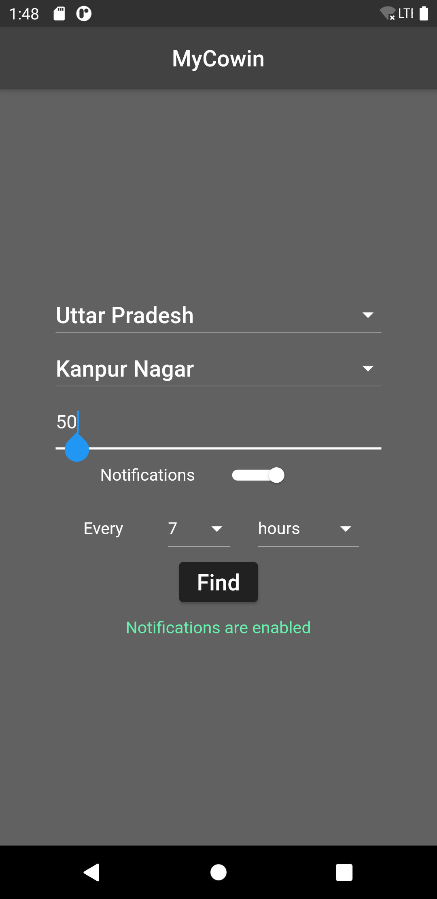
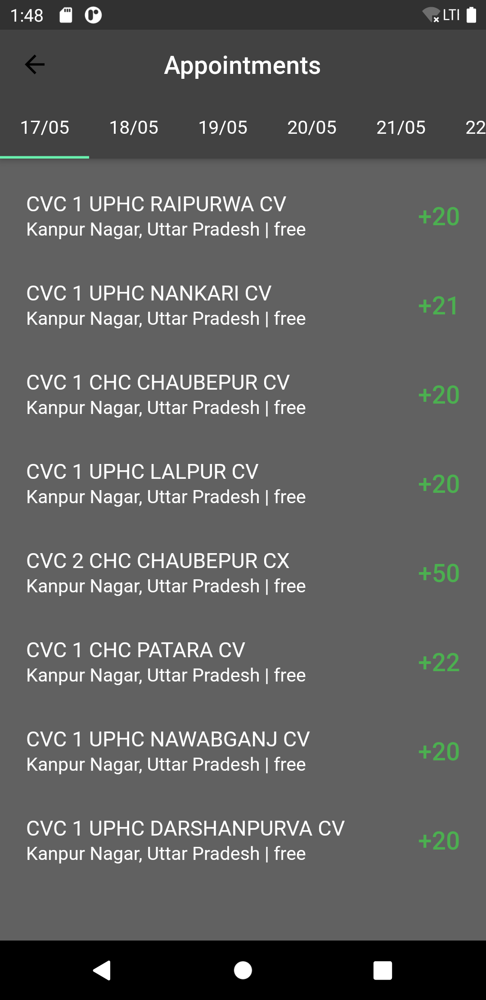

# MyCowin

Track COVID vaccine availability in your area in India.

A minimal mobile application that lets you check COVID vaccine availability in India based on your State and District.

Users can optionally enable notifications to be informed when vaccines are available in the chosen area.

The app was built using Flutter and is compatible with both Android and iOS devices.

## Screenshots

## Data

The availability data is source from the publicly available [Co-WIN APIs](https://apisetu.gov.in/public/api/cowinhttps://apisetu.gov.in/public/api/cowin)

## Notifications

- Android: Users can request for availability notifications at intervals ranging from 15 minutes to 7 days.

- iOS: Users can request for availability notifications at intervals ranging from 15 minutes to 7 days.
  NOTE: The app leverages iOS background fetches which have a minimum allowed frequency of 15 minutes and aren't guaranteed either. Therefore, the notifications on iOS aren't 100% reliable.
